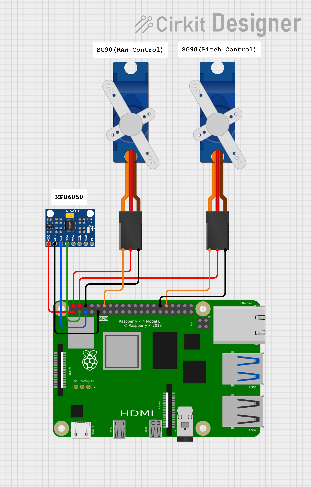

# 2-axis Gimbal Stabilizer

This project is an 2-axis gimbal stabilizer for `Raspberry Pi 4B` that using custom `MPU6050` Linux kernel driver and `SG90` controller. 

## Cross-compile

1. Clone linux repo for rpi

    ```cmd
    git clone https://github.com/raspberrypi/linux
    ```

1. Copy the `arch` and `driver` folder to linux repo

1. Start cross compile

    ```cmd
    make ARCH=arm64 CROSS_COMPILE=aarch64-linux-gnu- bcm2711_defconfig
    make ARCH=arm64 CROSS_COMPILE=aarch64-linux-gnu- LOCALVERSION="-[customname]-raspi-" Image modules dtbs
    ```

1. Copy files to RPi

    You may need to insert RPi's SD card to your x86 computer and mount it.

    ```cmd
    sudo cp arch/arm64/boot/Image /media/[username]/bootfs/kernel-[custom_name].img
    sudo cp arch/arm64/boot/dts/broadcom/*.dtb /media/[username]/bootfs/
    sudo cp arch/arm64/boot/dts/overlays/*.dtb* /media/[username]/bootfs/overlays
    sudo env PATH=$PATH make ARCH=arm64 CROSS_COMPILE=aarch64-linux-gnu- M=drivers/char/ml-mpu6050 INSTALL_MOD_PATH=/media/[username]/rootfs modules_install
    ```

## Run

1. Circuit

    

1. Run the main code

    ```cmd
    gcc -o gimbal gimbal.c -lpigpio -lrt -lm
    ```
